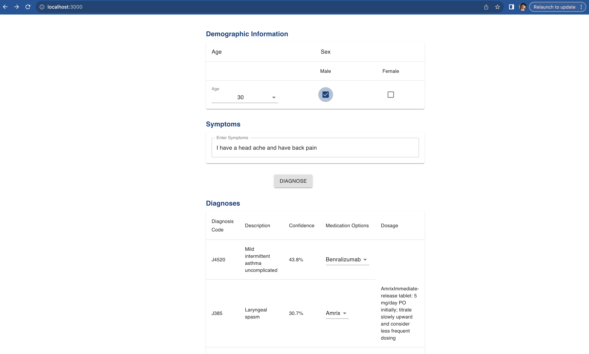
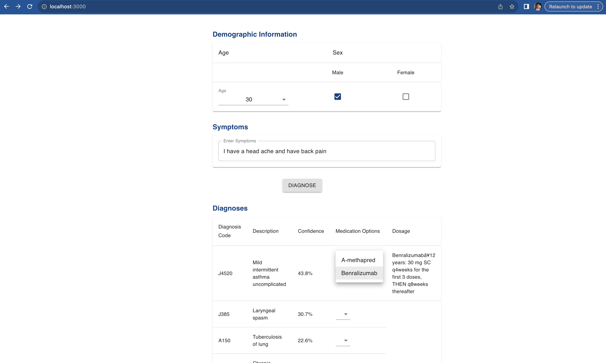
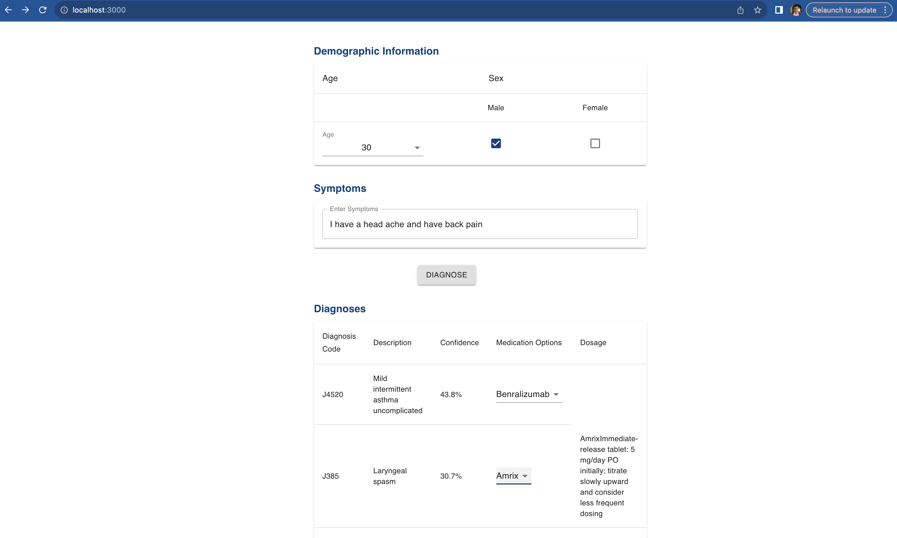
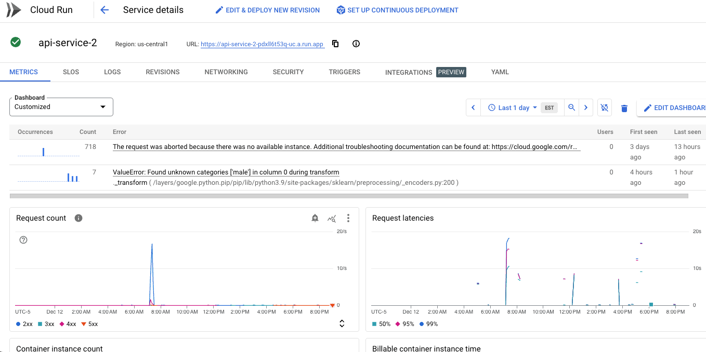

AC215 - The Prescribers
==============================
### [Presentation Video](https://youtu.be/21bDD7_GhOU?si=7odhCfuEjZxHw4PD)

### [Medium Blog Post](https://medium.com/institute-for-applied-computational-science/prescraibe-co-an-ml[…]ical-professionals-diagnose-and-prescribe-patients-e844cbdfb5f4)
---
<div align="center">

</div>

Notes:

    The files are empty placeholders only
    Never commit large data files,trained models, personal API Keys/secrets to GitHub

Project Organization
------------
```
.
├── LICENSE
├── README.md
├── compose.yml
├── data
│   ├── interim
│   └── raw
│       ├── diagnoses_output.json            <- Processed webscraped data
│       └── training_data.json.dvc
├── deprecated                               <- Depreciated files from previous Milestones
│   ├── dvc
│   │   ├── Dockerfile
│   │   ├── compose.yml
│   │   └── requirements.txt
│   └── gpt35
│       ├── Dockerfile
│       ├── Pipfile
│       ├── Pipfile.lock
│       └── fine_tune_API_GPT35.py
├── images
│   ├── prescriber_html_prototype.png
│   ├── solution-arch.png
│   ├── technical-arch.png
│   ├── vertix.png
│   └── wandb.png
├── notebooks                                <- Jupyter notebooks for webscraping, data processing, and model testing
│   ├── Predict_Bloom_model_fusion.ipynb
│   ├── api_py.py
│   ├── bloom_distillation_v3.ipynb
│   ├── bloom_distillation_v3.py
│   ├── bloom_training.ipynb
│   ├── bloom_training.py
│   ├── bloom_training_model_fusion.ipynb
│   ├── bloom_training_model_fusion.py
│   ├── create_age_sex_dataset.ipynb
│   ├── destillation_bloom_icd10.ipynb
│   ├── embeddings_bioBERT.ipynb
│   ├── extract_nhs_disease_data.ipynb
│   ├── fine_tune_API_GPT35.ipynb
│   ├── match_diagnosis_prescription.ipynb
│   ├── match_diagnosis_prescription.py
│   ├── model_py.py
│   ├── pre_processing.ipynb
│   └── pre_processing.py
├── references                                <- Reference papers
│   ├── 2212.13138.pdf
│   ├── 2303.18223.pdf
│   ├── 2306.05052.pdf
│   ├── 2307.03109.pdf
│   └── 2308.07633.pdf
├── reports                                   <- Previous milestone markdown submissions
│   ├── milestone2.md
│   └── milestone3.md
├── src                                       <- Source code and Dockerfiles for data processing and modeling
    │   ├── api-service-2                     <- Final model's API
│   │   ├── Dockerfile-service
│   │   ├── Procfile
│   │   ├── api
│   │   │   ├── __init__.py
│   │   │   └── model_load.py
│   │   ├── model
│   │   ├── prescription_database.tsv
│   │   ├── requirements.txt
│   │   └── service.py
│   ├── bloom                                 <- Model's training 
│   │   ├── Dockerfile
│   │   ├── Pipfile
│   │   ├── Pipfile.lock
│   │   └── bloom_training.py
│   ├── data                                  <- Scripts for dataset creation
│   │   ├── Dockerfile
│   │   ├── Pipfile
│   │   ├── Pipfile.lock
│   │   └── extract_nhs_disease_data.py
│   ├── data-age-sex                          <- Final dataset creation
│   │   ├── Dockerfile
│   │   └── create_age_sex_dataset.py
│   ├── distill                               <- Distillation process (not used in the final version)
│   │   ├── Dockerfile
│   │   ├── Pipfile
│   │   ├── Pipfile.lock
│   │   └── bloom_distillation_v3.py
│   ├── embeddings_biobert                    <- Data processing and embedding with ICD-10
│   │   ├── Dockerfile
│   │   ├── Pipfile
│   │   ├── Pipfile.lock
│   │   └── embeddings_biobert_harmonized.py
│   ├── frontend                              <- Code of App's front end
│   │   ├── Dockerfile
│   │   ├── Dockerfile.dev
│   │   ├── docker-shell.bat
│   │   ├── docker-shell.sh
│   │   ├── package-lock.json
│   │   ├── package.json
│   │   ├── public
│   │   │   ├── index.html
│   │   │   └── manifest.json
│   │   ├── src
│   │   │   ├── app
│   │   │   │   ├── App.css
│   │   │   │   ├── App.js
│   │   │   │   ├── AppRoutes.js
│   │   │   │   └── Theme.js
│   │   │   ├── common
│   │   │   │   ├── Content
│   │   │   │   │   ├── index.js
│   │   │   │   │   └── styles.js
│   │   │   │   ├── Footer
│   │   │   │   │   ├── index.js
│   │   │   │   │   └── styles.js
│   │   │   │   └── Header
│   │   │   │       ├── index.js
│   │   │   │       └── styles.js
│   │   │   ├── components
│   │   │   │   ├── Audio2Text
│   │   │   │   │   ├── index.js
│   │   │   │   │   └── styles.js
│   │   │   │   ├── Blank
│   │   │   │   │   ├── index.js
│   │   │   │   │   └── styles.js
│   │   │   │   ├── Chat
│   │   │   │   │   ├── index.js
│   │   │   │   │   ├── style.css
│   │   │   │   │   └── styles.js
│   │   │   │   ├── DemographicsTable
│   │   │   │   │   ├── index.js
│   │   │   │   │   └── styles.js
│   │   │   │   ├── Error
│   │   │   │   │   └── 404.js
│   │   │   │   ├── Home
│   │   │   │   │   ├── index.js
│   │   │   │   │   └── styles.js
│   │   │   │   ├── ImageClassification
│   │   │   │   │   ├── index.js
│   │   │   │   │   └── styles.js
│   │   │   │   ├── Plots
│   │   │   │   │   ├── index.js
│   │   │   │   │   └── styles.js
│   │   │   │   ├── SubmitButton
│   │   │   │   │   ├── index.js
│   │   │   │   │   └── styles.js
│   │   │   │   ├── SymptomMenu
│   │   │   │   │   ├── index.js
│   │   │   │   │   └── styles.js
│   │   │   │   ├── SymptomTable
│   │   │   │   │   ├── index.js
│   │   │   │   │   └── styles.js
│   │   │   │   ├── TOC
│   │   │   │   │   ├── index.js
│   │   │   │   │   └── styles.js
│   │   │   │   ├── Text2Audio
│   │   │   │   │   ├── index.js
│   │   │   │   │   └── styles.js
│   │   │   │   └── Todo
│   │   │   │       ├── index.js
│   │   │   │       └── styles.js
│   │   │   ├── index.css
│   │   │   ├── index.js
│   │   │   └── services
│   │   │       ├── Common.js
│   │   │       └── DataService.js
│   │   └── yarn.lock
│   └── workflow
│       ├── Dockerfile
│       ├── Pipfile
│       ├── Pipfile.lock
│       └── cli.py
└── .github/workflows                           <- Code for App deployment to GCP
│   ├── cloud-run.yml
│   ├── collect-nhs.yml
│   ├── data-age-sex.yml
│   ├── distill.yml
│   ├── embeddings_biobert.yml
│   ├── frontend.yml

```
46 directories, 123 files


# AC215 - Final Project

**Team Members**
Nathan Weeks, Phill Salazar, Alvaro Morales, Shreya Chaturvedi  

**Group Name**
The Prescribers

**Project - Problem Definition**
This project aims to develop a solution that offers diagnostic recommendations and prescription suggestions to medical professionals based on the demographic characteristics and symptoms of patients.


## Data Description 

PrescrAIbe.co is a tool designed to predict a patient's diagnosis and the corresponding prescription. To train the machine learning models responsible for these predictions, we require a dataset that includes symptom descriptions and their associated diagnoses and prescriptions. Consequently, the data for the prototype of this project is sourced from various origins.

The primary source of information for diagnoses in our project will be the [DDXPlus Dataset](https://github.com/bruzwen/ddxplus/tree/main), created by Arsene Fansi Tchango, Rishab Goel, Zhi Wen, Julien Martel, and Joumana Ghosn. This dataset comprises synthesized patient profiles using a proprietary medical knowledge base and a commercial rule-based ASD system. It characterizes patients with socio-demographic data, a specific pathology, related symptoms and antecedents, and a differential diagnosis.

The prescription data, displayed to the user in our app, is linked to the predicted diagnosis. We sourced the prescription information from Medscape, a website that offers health information to doctors, practitioners, and scientists. Utilizing this source, we developed a tool that compiles a dataset containing details about medicines, their indications (the conditions they treat), and dosage instructions. This raw, unstructured information was then processed. Using bioBERT from Hugging Face, we embedded the medical conditions, and through cosine similarity, matched them to the diagnosis descriptions and codes we had previously established.

## Proposed Solution

After completions of building a robust ML Pipeline in our previous milestone we have built a backend api service and frontend app. This will be our user-facing application that ties together the various components built in previous milestones.

**prescrAIbe.co**

prescrAIbe.co uses a React front end hosted on GitHub Pages. A source code change that is pushed to the GitHub repository triggers a GitHub Actions workflow that automatically rebuilds and deploys the site.

The following screenshots show the local deployment of the app:





**Kubernetes Deployment**

Google Cloud Run was chosen as the deployment platform for ease of deployment and scalability. Instead of creating a custom container image and pushing it to a registry for deployment, we chose source deployment to utilize Google Cloud buildpacks for ensuring an up-to-date software environment and container-build security best practices in the resulting container image deployed on Cloud Run.

Here is our deployed app on Google Cloud Run



### Code Structure

A Docker compose file (compose.yml) facilitates local deployment of most services.
The "workflow" service is for running jobs on Vertex AI.

**API Service Container**
This container has all the python files to run and expose the backend API.

To run the container locally:
- Copy the custom model to src/api-service-2/model
- Run `docker compose up api`
- Test API at http://localhost:8080/test

**Frontend Container**
This container contains all the files to develop and build a react app. There are dockerfiles for both development and production

To run the container locally:
- Run `sh docker-shell.sh`
- If running the container for the first time, run `yarn install`
- Once inside the docker container run `yarn start`
- Go to `http://localhost:3000` to access the app locally

### CI/CD using GitHub Actions

CI/CD pipelines were implemented using GitHub Actions.
Our GitHub Actions workflows are located in the standard `.github/workflows` directory.

* `cloud-run.yml` - Workflow to deploy the API service (src/api-service-2) to Google Cloud Run.
  Manually triggerd (on workflow dispatch).
* `collect-nhs.yml` - Worfklow to build & push the src/data container (which scraptes NHS data) to Google Artifact Registry to facilitate execution on Vertex AI.
  Rebuilt on pull request; pushed on commit to main that modifies src/data.
* `data-age-sex.yml` - Worfklow to build & push the src/data-sex-age container to Google Artifact Registry to facilitate execution on Vertex AI.
  Rebuilt on pull request; pushed on commit to main that modifies src/data-sex-age.
* `distill.yml` - Worfklow to build & push the src/distill container to Google Artifact Registry to facilitate execution on Vertex AI.
  Rebuilt on pull request; pushed on commit to main that modifies src/distill.
* `embeddings_biobert.yml` Worfklow to build & push the src/embeddings container (model fine-tuning) to Google Artifact Registry to facilitate execution on Vertex AI.
  Rebuilt on pull request; pushed on commit to main that modifies src/embeddings_biobert.
* `frontend.yml` Workflow to build the React-based frontend in src/frontend and deploy for hosting on GitHub Pages.
  The resulting static site is deployed if the build was triggered by a source code change in the `main` branch that affects src/frontend. 

